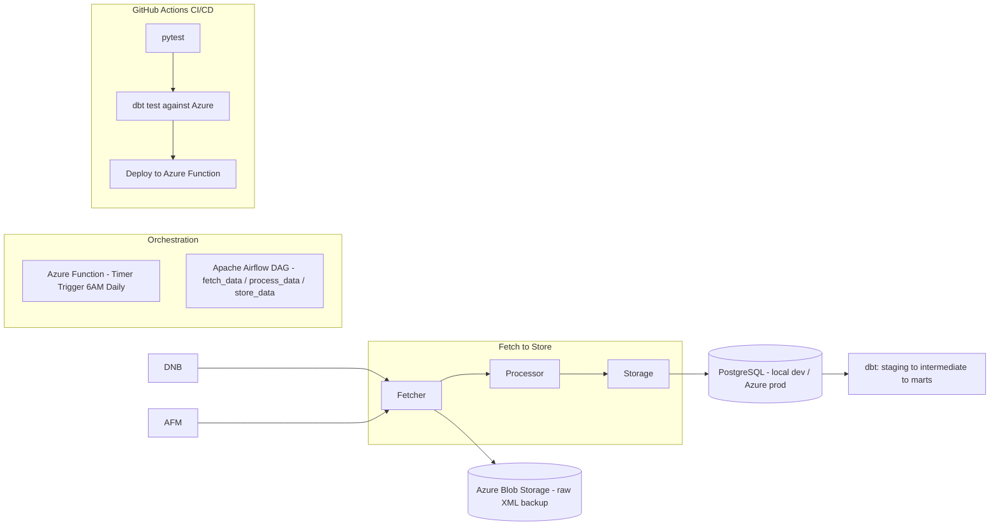

# Dutch Financial Regulatory Monitoring Pipeline

An automated pipeline that monitors DNB (De Nederlandsche Bank) and AFM (Autoriteit Financiële Markten) — the Netherlands' two primary financial regulators — for new publications, storing them in a structured, queryable format and transforming them into analytics-ready models for compliance and risk teams.

DNB supervises whether financial institutions are financially sound. AFM supervises whether they treat customers fairly. A real compliance team needs to track publications from both, since they cover genuinely different regulatory concerns.

---

## Architecture



**Fetcher** — one shared function handles both DNB and AFM's RSS feeds, since both follow the same standard RSS/XML structure. DNB specifically requires Playwright (a real, headless browser) rather than a standard HTTP client — see the debugging deep dive below for why.

**Processor** — pure, side-effect-free transformation functions: date parsing (RFC 822 → timezone-aware `datetime`), HTML cleanup (escaped entities inside XML descriptions), and validation (identity fields like `title`/`link`/`guid` are required; descriptive fields like `description` are optional, based on confirmed real-world DNB data showing empty descriptions are normal).

**Storage** — deduplicates using each publication's `guid` (DNB's feed lacks a native `guid`, so its own `link` is used as a substitute unique identifier). A `PIPELINE_ENV` environment variable switches the entire connection — `local` (default) targets a local PostgreSQL instance for safe development; `azure` targets the live Azure PostgreSQL database. This mirrors the same `dev`/`prod` split used throughout the project (dbt targets, database credentials) rather than hardcoding one environment.

**dbt** — a staging layer normalizes raw data (casing, nulls); an intermediate model calculates each regulator's historical publication average; three marts answer real questions: month-over-month trend (window functions), above/below-average months (cross-model joins), and an incrementally-materialized activity log. Runs against `dev` (local) by default, `--target prod` (Azure) explicitly.

**Orchestration — two parallel, deliberately separate implementations:**
- An **Azure Function**, timer-triggered daily at 6 AM, running the pipeline as one atomic unit — fetch, process, store in a single execution, with Azure's own logging as the only visibility into what happened.
- An **Apache Airflow DAG** (built using the TaskFlow API, running under WSL2, since Airflow requires a Linux environment), breaking the same pipeline into three independently-tracked, dependency-aware tasks (`fetch_data → process_data → store_data`), enabling per-step visibility, automatic retries, and the ability to re-run a single failed step without repeating already-successful work. Both exist deliberately: the Azure Function demonstrates simple, single-unit cloud scheduling; the Airflow DAG demonstrates orchestration at a level of granularity a plain timer trigger cannot provide.

**CI/CD (GitHub Actions)** — three chained jobs (`test → dbt-test → deploy`), triggered on every push and pull request to `main`. `test` runs the full `pytest` suite in an isolated environment. `dbt-test` runs `dbt run`/`dbt test --target prod` against the live Azure database, using GitHub Secrets injected as environment variables. `deploy` — gated behind both previous jobs succeeding, and restricted to the `main` branch only — attempts to publish the Function App automatically via Microsoft's official `Azure/functions-action`.

### Current deployment status — stated honestly

`test` and `dbt-test` run successfully in GitHub Actions — the pipeline's correctness and its behavior against real, live Azure data are both verified through genuine, automated CI. The `deploy` job correctly attempts deployment but fails at the same point manual deployment did: **Python Function Apps require a Linux-based Consumption hosting plan, unavailable on this trial subscription.** This is a documented Azure account-tier limitation (confirmed against Microsoft's own support forums), not a defect in the pipeline, the Function code, or the CI/CD configuration — all of which are correctly built and independently verified.

---

## Engineering Deep Dive: The DNB 403 Investigation

DNB's RSS feed returned `403 Forbidden` exclusively when requested via Python's `requests` library, while succeeding identically in a browser and via `curl`.

Systematic investigation ruled out, in order: an incorrect URL (confirmed valid by opening it directly in a browser), a `User-Agent` check alone (still failed after sending genuine Chrome headers), and a redirect (`allow_redirects=False` showed no `Location` header — the 403 was immediate). Inspecting the actual response body — not just the status code — revealed an HTML page referencing **Akamai**, a commercial bot-detection service, rather than the expected XML.

Since Akamai distinguishes real browser traffic at a level a lightweight HTTP client cannot replicate, the fetcher was rebuilt using **Playwright**, launching a genuine headless Chromium browser instead of `requests`. This resolved the block completely.

A second, separate bug then surfaced: only one item was being returned per feed — a pre-existing indentation error (`return` sitting one level too deep inside the item-processing loop), silently masked because AFM's feed, used during earlier testing, happened to contain exactly one item.

---

## Setup

```bash
pip install -r requirements.txt
playwright install chromium
```

`.env`:
```
DB_USER=postgres
DB_PASSWORD=...
DB_HOST=localhost
DB_PORT=5432
DB_NAME=dutch_regulatory

AZURE_DB_USER=...
AZURE_DB_PASSWORD=...
AZURE_DB_HOST=...postgres.database.azure.com
AZURE_DB_PORT=5432
AZURE_DB_NAME=dutch_regulatory

BLOB_CONNECTION_STRING=...
```

```bash
python main.py                        # local (default)
PIPELINE_ENV=azure python main.py     # against live Azure data
```

### Azure Function (local verification)
```bash
azurite                                          # separate terminal
cd dutch_regulatory_function && .venv\Scripts\activate && func start
curl -X POST http://localhost:7071/admin/functions/RunPipeline -d "{}"
```

### Airflow (WSL2 required)
DAG lives at `~/airflow/dags/dutch_regulatory_pipeline_dag.py`, importing project modules from the Windows filesystem via `/mnt/c/...` and `sys.path.append`.
```bash
airflow standalone   # http://localhost:8080
```

### dbt
```bash
dbt run && dbt test                                # local dev data
dbt run --target prod && dbt test --target prod     # live Azure data
```

### CI/CD
`.github/workflows/ci.yml` runs automatically on push/PR to `main`. Requires four GitHub Secrets: `AZURE_DB_HOST`, `AZURE_DB_USER`, `AZURE_DB_PASSWORD`, `AZURE_FUNCTIONAPP_PUBLISH_PROFILE`.

---

## Known Limitations

- Azure Function deployment to live cloud infrastructure is blocked by a free-tier subscription restriction — verified correct and working when run locally, and when tested via GitHub Actions' `test`/`dbt-test` jobs against the real Azure database.
- Raw XML backup to Azure Blob Storage is implemented; upload verification was performed with test data rather than a full production run.
- No dedicated `test`/`staging` database environment — `dev` (local) and `prod` (Azure) only, a deliberate simplification for a portfolio-scale project.

---

## Tech Stack

Python · Playwright · SQLAlchemy · PostgreSQL (local + Azure) · dbt · Apache Airflow (WSL2) · Azure Functions · Azure Blob Storage · GitHub Actions