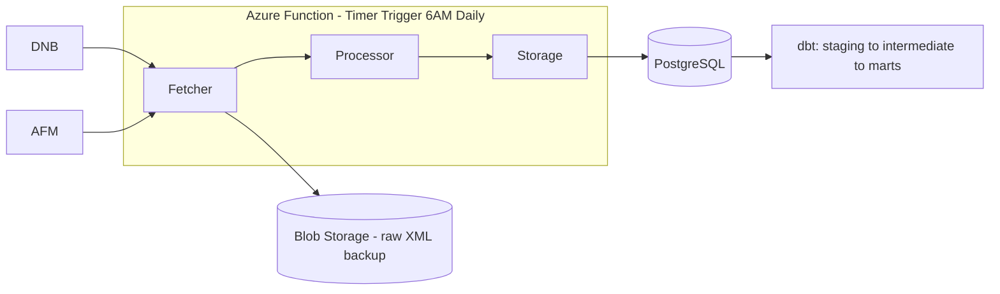

# Dutch Financial Regulatory Monitoring Pipeline

An automated pipeline that monitors DNB (De Nederlandsche Bank) and AFM (Autoriteit Financiële Markten) — the Netherlands' two primary financial regulators — for new publications, storing them in a structured, queryable format and transforming them into analytics-ready models for compliance and risk teams.

DNB supervises whether financial institutions are financially sound. AFM supervises whether they treat customers fairly. A real compliance team needs to track publications from both, since they cover genuinely different regulatory concerns.

---

## Architecture



**Fetcher** — one shared function handles both DNB and AFM's RSS feeds, since both follow the same standard RSS/XML structure. DNB specifically requires Playwright (a real, headless browser) rather than a standard HTTP client — see the debugging deep dive below for why.

**Processor** — pure, side-effect-free transformation functions: date parsing (RFC 822 → timezone-aware `datetime`), HTML cleanup (escaped entities inside XML descriptions), and validation (identity fields like `title`/`link`/`guid` are required; descriptive fields like `description` are optional, based on confirmed real-world DNB data showing empty descriptions are normal).

**Storage** — deduplicates using each publication's `guid` (DNB's feed lacks a native `guid`, so its own `link` is used as a substitute unique identifier) — ensuring repeated runs only insert genuinely new publications.

**dbt** — a staging layer normalizes raw data (casing, nulls); an intermediate model calculates each regulator's historical publication average; three marts answer real questions: month-over-month trend (window functions), above/below-average months (cross-model joins), and an incrementally-materialized activity log.

### Current deployment status

The pipeline runs as a genuine Azure Function — fetching, processing, and storing real DNB/AFM publications into Azure PostgreSQL — verified via Azure Functions Core Tools running locally against the live Azure database (75 real publications fetched, processed, and saved in a confirmed test run).

Deploying the function to run autonomously on Azure's own infrastructure, on its 6 AM daily schedule, was blocked by a free-tier subscription restriction: Python Function Apps require a Linux-based Consumption hosting plan, which was not available on this trial account. This is a documented Azure limitation (confirmed against Microsoft's own support forums), not a code or architecture issue — the function itself is correctly built and verified against real cloud data.

---

## Engineering Deep Dive: The DNB 403 Investigation

DNB's RSS feed returned `403 Forbidden` exclusively when requested via Python's `requests` library, while succeeding identically in a browser and via `curl`.

Systematic investigation ruled out, in order: an incorrect URL (confirmed valid by opening it directly in a browser), a `User-Agent` check alone (still failed after sending genuine Chrome headers), and a redirect (`allow_redirects=False` showed no `Location` header — the 403 was immediate). Inspecting the actual response body — not just the status code — revealed an HTML page referencing **Akamai**, a commercial bot-detection service, rather than the expected XML.

Since Akamai distinguishes real browser traffic at a level a lightweight HTTP client cannot replicate (beyond headers — likely TLS fingerprinting and JavaScript execution behavior), the fetcher was rebuilt using **Playwright**, launching a genuine headless Chromium browser instead of `requests`. This resolved the block completely, with zero further header manipulation required.

A second, separate bug then surfaced: only one item was being returned per feed. This was not a new Akamai-related issue — it was a pre-existing indentation error (`return` sitting one level too deep, inside the item-processing loop instead of after it) that had been silently masked because AFM's feed, used during earlier testing, happened to contain exactly one item.

---

## Setup

```bash
pip install -r requirements.txt
playwright install chromium
```

Create a `.env` file with:

```
LOCAL_DB_USER=postgres
LOCAL_DB_PASSWORD=...
LOCAL_DB_HOST=localhost
LOCAL_DB_PORT=5432
LOCAL_DB_NAME=dutch_regulatory

AZURE_DB_USER=...
AZURE_DB_PASSWORD=...
AZURE_DB_HOST=...postgres.database.azure.com
AZURE_DB_PORT=5432
AZURE_DB_NAME=dutch_regulatory

BLOB_CONNECTION_STRING=...
```

Run the pipeline directly:

```bash
python main.py
```

### Running as an Azure Function locally

```bash
azurite                                          # separate terminal — simulates Azure storage
cd dutch_regulatory_function
.venv\Scripts\activate
func start                                       # separate terminal
curl -X POST http://localhost:7071/admin/functions/RunPipeline -H "Content-Type: application/json" -d "{}"
```

### dbt

```bash
dbt run && dbt test                  # against local dev data
dbt run --target prod && dbt test --target prod   # against live Azure data
```

---

## Known Limitations

- Azure Function deployment to live cloud infrastructure is blocked by a free-tier subscription restriction (Python requires a Linux Consumption plan, unavailable on this trial account) — verified working correctly when run locally against the real Azure database.
- Contributor-style deduplication on re-run relies on `guid` uniqueness at the database level; incremental dbt materialization is currently implemented only for `mart_recent_activity_log`.
- Raw XML backup to Azure Blob Storage is implemented but not yet exercised against a live pipeline run.

---

## Tech Stack

Python · Playwright · SQLAlchemy · PostgreSQL (local + Azure) · dbt · Azure Functions · Azure Blob Storage